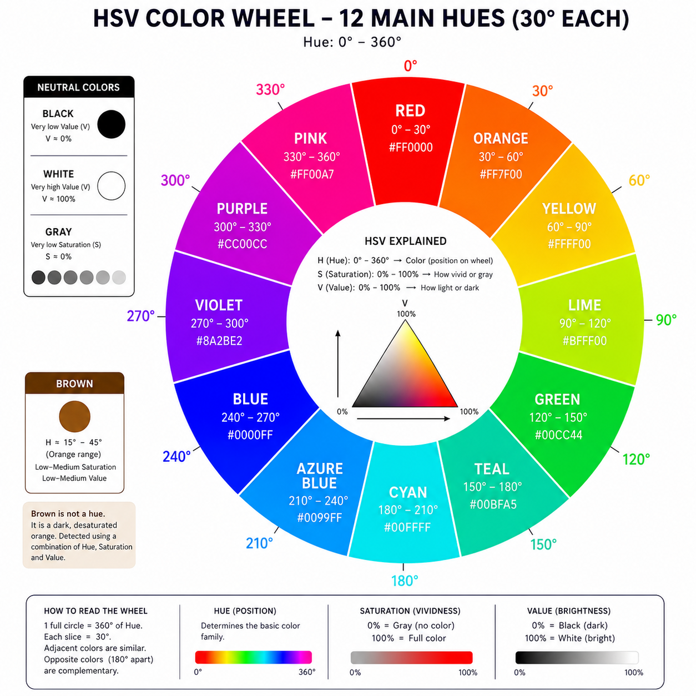
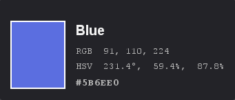

# Colorblind colorpicker
## Story behind this project
As a colorblind person trying to learn pixel art, i've had struggles just trying to select the "base" color for me to use. 

An example question i've had is `I want to color leaves, which color is green` and i somehow choose a brown color. Yes, i could have copied the RGB values and asked good old Copilot/ChatGPT what the color is, but that was tedious

So, i decided i want to create a very simple, and, hopefully usable color picker that sole purpose isn't to copy hex/rgb
values into clipboard, but instead interprets what the color you have selected is, and tells you in plain English.

If this helps even one other person, I will be glad. If anyone else has some improvements to add to this, by all means.

## Detection method
The best method so far i've found, is to create a HSV decision tree, and use that one, with possible tweaks. I don't need much colors, i just need to figure out `is this a green or is this a brown color`, i don't need the actual "fancy" name.

Essentially it is just a very simple decision tree, mostly relying on the Hue value that follows the wheel below, but also looks at saturation and value for detecting Brown, Gray, Black and White

This is the color wheel implementation i have got implemented as a generic set of colors i personally use (well try to at least) on a day to day basis/
Note: I am playing around with the boundaries of each color, currently they are all shifted by 15 degrees to the left

## How to use
- Start application
- While running, press `Ctrl` + `Alt` + `Shift` + `/`
- Your cursor will turn into a little cross
- Select the pixel / color you want to check out, and click
- After clicking, a small popup will show up on your screen with the estimation on what color it is
  - I also included some additional info, like RGB values, HSV values and hex representation so it functions as an actual color picker
- To remove the popup, just press `Esc`

I've checked with multiple non-colorblind people, and for the most part, this gives the correct results.
The only issue i have so far is with darker saturation of yellows, which humans apparently perceive as greens (or lime)
I plan on fixing this however when i figure out the thresholds for these and account for them.